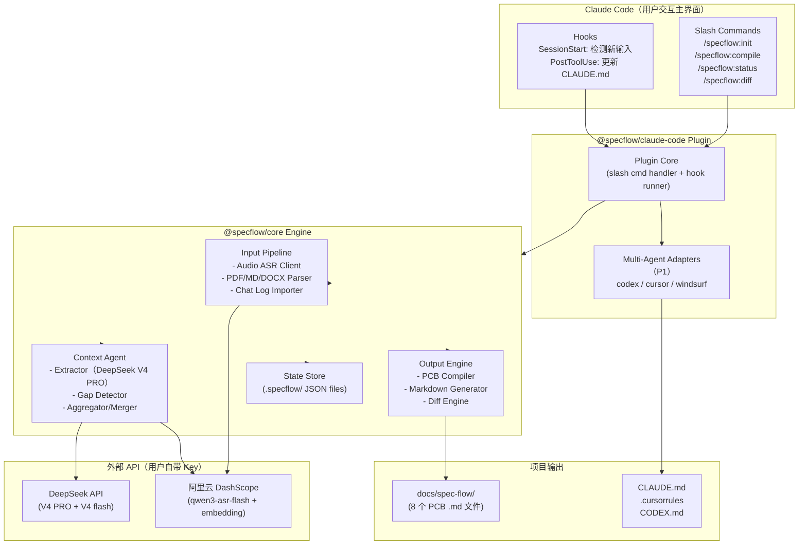
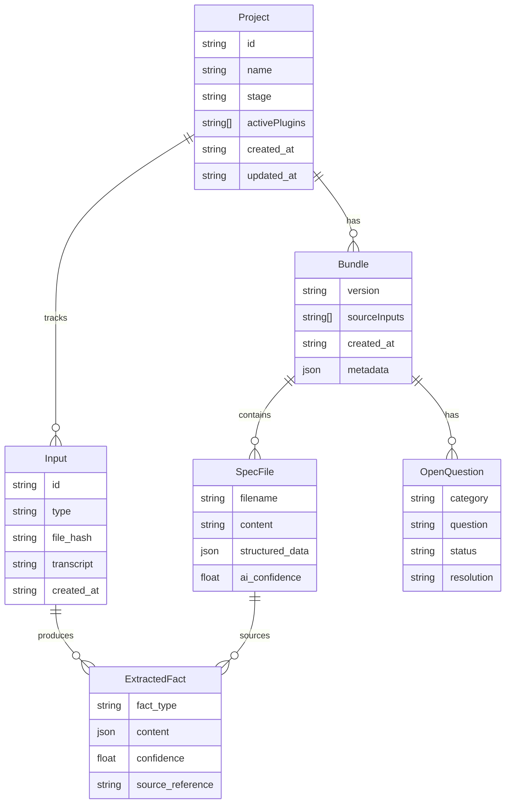
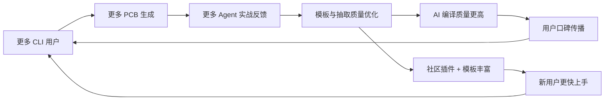
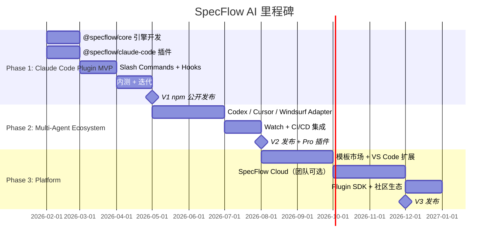

完美，方案已经非常清晰了。我先帮你把最终方案定稿，然后输出完整产品架构设计文档。

---

# 最终方案确认

- **产品名**：SpecFlow AI
- **形态**：Claude Code 原生插件（slash commands + hooks），多端 Agent 适配，开源（MIT）
- **目标用户**：独立开发者 / Solo Builder / AI Native 小团队
- **核心场景**：在 Claude Code 中直接调用 `/specflow:compile`，将会议录音/文档编译为 PCB
- **集成方式**：Claude Code 内 slash command → 引擎编译 → 文件写入项目目录 → Claude Code 自动加载
- **风格**：现实可落地 + AI Native 前瞻性平衡

下面是完整文档。

---

# SpecFlow AI 产品架构设计文档

> Claude Code 原生插件系统——在 Claude Code 对话中直接调用 `/specflow:compile`，将会议、PRD 与协作讨论编译为 Project Context Bundle。

**版本**：v3.0（Claude Code 插件重构版）
**作者**：[Your Name]

---

## 一、产品概述

### 1.1 产品名称与一句话定义

**SpecFlow AI** —— AI 时代的项目上下文编译器（Claude Code 原生插件）。
它是一套 Claude Code slash commands + hooks，让你在 Claude Code 对话中直接调用 `/specflow:compile`，将产品讨论、会议录音、文档自动编译为 Claude Code 可直接执行的结构化上下文包（Project Context Bundle, PCB），直接写入项目目录。无需退出 Claude Code、无需登录、数据不出本机。

### 1.2 解决的核心问题

#### 表层问题
独立开发者在使用 Claude Code、Codex、Cursor 等 AI coding agent 时，每次都需要重复解释项目背景、技术约束、产品目标、未决问题，导致：
- 上下文喂得不准 → AI 输出偏差大
- 多轮解释成本高 → 开发节奏被打断
- 决策散落在会议、聊天、笔记中 → AI 无法看到全貌
- 需求变更后 AI 仍基于旧上下文工作 → 返工严重

#### 深层问题
> **传统人类协作信息体系（会议纪要、PRD、聊天记录）是为人类沟通设计的，并不天然适合 AI 执行。**

AI 编程时代缺少一层关键基础设施：

```
人类协作信息  →  [缺失：语义编译层]  →  AI 可执行上下文
```

SpecFlow AI 就是填补这一层。

#### 为什么现在做？

1. Claude Code、Codex、Cursor、Windsurf 等 coding agent 已经从"玩具"变为生产力工具
2. 独立开发者群体爆发，他们没有传统团队的文档流程，但更依赖 AI
3. 大模型在结构化抽取与长文本理解上已具备生产级能力
4. AI Native 协作模式正在形成新的基础设施空白期

---

### 1.3 目标用户画像

#### 用户角色 A：Solo Builder / Indie Hacker（核心用户）

| 维度 | 描述 |
|---|---|
| 特征 | 1 人或 2-3 人小团队，独立开发 SaaS / 工具 / AI 应用 |
| 工具栈 | Claude Code / Cursor / GitHub / Notion / 飞书或 Slack |
| 痛点 | 没时间写正式 PRD，但 AI 编程又必须有清晰上下文；脑暴和聊天记录无法直接喂给 AI；改一次需求要重新解释一遍 |
| 动机 | 把 70% 的"解释成本"省下来，让 AI 真正成为代码生产力 |
| 付费意愿 | 愿为 Pro 插件付费（$8-15/月）；核心 CLI 开源免费 |

#### 用户角色 B：AI Native 小团队 Tech Lead（次要用户）

| 维度 | 描述 |
|---|---|
| 特征 | 3-10 人小团队的技术负责人 / 全栈 PM |
| 工具栈 | GitHub + Claude Code + Linear/Jira + 飞书 |
| 痛点 | 团队讨论很多但落到 AI 执行时上下文不一致；新成员或 AI agent 上手成本高 |
| 动机 | 让团队和 AI agent 共享同一份"活的"项目上下文 |
| 付费意愿 | 高，按席位付费 |

#### 用户角色 C：技术型产品经理（潜在用户）

| 维度 | 描述 |
|---|---|
| 特征 | 自己做需求 + 自己跟 AI 写代码原型的 PM |
| 痛点 | 在"产品语言"和"AI 执行语言"之间反复转换，耗时巨大 |
| 动机 | 用 AI 做更多原型验证，减少和工程师的来回沟通 |

---

### 1.4 核心使用场景

#### 场景 1：周五晚的 Solo Builder 灵感落地

> 张涛是个独立开发者。周五晚他和合伙人在飞书语音聊了 40 分钟，定了一个新功能方向。
> 第二天他打开 Claude Code，在对话中输入 `/specflow:compile --audio call.m4a`。
> Claude Code 内显示编译进度：8 分钟后完成，生成 8 个 PCB 文件、3 个 Open Questions。
> 他紧接着输入 `/specflow:status`，Claude Code 列出文件摘要和未决问题。
> 无需切换窗口——Claude Code 已经基于刚生成的 `CLAUDE.md` + `docs/spec-flow/` 开始工作。

#### 场景 2：技术方案讨论会后的快速对齐

> 一个 3 人 AI Native 团队开了 1 小时技术评审会。Tech Lead 在 Claude Code 中输入 `/specflow:compile --audio tech-review.mp3`。
> 编译完成后 Claude Code 输出红字标注：
> ⚠ Open Question: "数据库选型未达成最终共识（PostgreSQL vs TiDB）"
> 团队讨论后决策选择 PostgreSQL，Tech Lead 在 Claude Code 会话中直接更新 `08_decision_log.md`。

#### 场景 3：需求变更的增量同步

> 第二周产品方向调整。Tech Lead 在 Claude Code 中运行 `/specflow:compile --audio pivot-chat.m4a`。
> SpecFlow 自动 diff 出 3 处变更，Claude Code 内直接输出：
> ```
> Δ 01_product_spec.md — 用户角色变化
> Δ 03_technical_constraints.md — 删除功能 "排行榜"
> + 05_task_breakdown.md — 新增验收标准 AC-3
> ```
> Claude Code 下次对话自动加载更新后的上下文。

#### 场景 4：从 0 到 1 项目启动

> 一个 Indie Hacker 想做新项目。他在 Claude Code 中打开空项目目录，输入：
> `/specflow:init`
> `/specflow:compile --text braindump.md --text competitor-analysis.md`
> 两个 slash command 后，项目目录已有完整的 PCB + `CLAUDE.md`。Claude Code 即时可用。

#### 场景 5：本地面板可视化审查

> 张涛输入 `/specflow:status` 查看 Open Questions。黄色高亮标注了 3 个 AI 不确定项。
> 他在同一个 Claude Code 会话中逐一讨论并确认决策，SpecFlow 自动更新相关 PCB 文件。
> 全程未离开 Claude Code 窗口。

## 二、产品定位与策略

### 2.1 价值主张

| 维度 | 内容 |
|---|---|
| **For**（用户） | AI Native 独立开发者与小团队 |
| **Who**（痛点） | 苦于在 AI coding agent 前反复解释项目上下文 |
| **Our product is** | 一套 Claude Code 原生插件（slash commands + hooks），直接嵌入 Claude Code 工作流 |
| **That**（核心价值） | 在 Claude Code 对话中直接编译会议/文档为 PCB，无需切换工具 |
| **Unlike**（差异化） | 传统会议助手（Otter）、文档工具（Notion）、手动维护 CLAUDE.md、独立 CLI 工具 |
| **Our product**（壁垒） | 唯一深度集成 Claude Code 插件体系的项目上下文编译器，编译→审查→编程全在 Claude Code 内完成 |

### 2.2 竞品分析

| 维度 | SpecFlow AI | Otter / Fireflies / 飞书妙记 | Notion AI / Confluence | Cursor / Claude Code 自身 | Linear / Jira |
|---|---|---|---|---|---|
| 核心定位 | AI 上下文编译器 | 会议纪要工具 | 文档协作平台 | AI 编程工具 | 任务管理 |
| 输入源 | 会议+文档+聊天+repo | 会议为主 | 文档为主 | 代码+对话 | 任务为主 |
| 输出物 | AI-ready Context Bundle | 摘要 + Action Items | 自由文档 | 代码 | Issue / Ticket |
| 是否面向 AI agent | ✅ 核心目标 | ❌ | ⚠️ 弱 | ✅ 但需手动喂上下文 | ❌ |
| 结构化能力 | ✅ 多维抽取 + 模板编译 | ⚠️ 弱 | ❌ 自由格式 | ❌ | ⚠️ 仅任务字段 |
| 缺失信息识别 | ✅ | ❌ | ❌ | ⚠️ 被动追问 | ❌ |
| 变更追踪 | ✅ Spec Diff | ❌ | ⚠️ 版本但不智能 | ❌ | ⚠️ |
| GitHub 集成 | ✅ Repo Push | ❌ | ⚠️ 弱 | ✅ | ✅ |
| 适合独立开发者 | ✅ | ⚠️ | ⚠️ 重 | ✅ | ⚠️ 重 |

**核心差异化**：

> 我们是唯一专门为 **"从人类讨论 → AI coding agent 可执行上下文"** 这一断层而设计的产品。

### 2.3 市场切入点与差异化策略

#### 切入点：Claude Code / Codex 深度用户社区
**理由**：
1. 这是最早期、最深度使用 AI coding agent 的人群，天然需要上下文编译工具
2. 他们深度使用 Claude Code，slash commands 零学习成本
3. 社区聚集（X / Reddit r/ClaudeCode / npm / GitHub）易于冷启动
4. 单用户即可形成完整闭环，开源分发零边际成本

#### 差异化策略

##### 1. 不做"通用会议助手"，而做"AI 项目上下文编译器"
拒绝和 Otter / 妙记正面竞争，以 CLI 开源工具形态区隔。

##### 2. 输出标准：Project Context Bundle（PCB）
建立行业新标准——AI 编程时代的 PRD 格式，通过 npm/npx 分发形成事实标准。

##### 3. 插件矩阵而非平台锁定
- 一套 PCB，多 Agent 输出（CLA.md, CODEX.md, .cursorrules 等）
- 插件接口开放，社区可贡献新 Agent 适配
- 不与任何单一 Agent 绑定

##### 4. 缺失信息驱动设计
不是被动总结，而是主动发现盲点 → 核心壁垒。

### 2.4 北极星指标 + 关键支撑指标

#### 北极星指标
**Weekly AI-Executable Context Bundles Generated**
（每周通过 SpecFlow CLI 生成并写入项目目录的 PCB 数量）

> 选择理由：这个指标同时绑定"使用量"+"真实价值产生"，比纯下载量更能反映产品是否在创造效率。

#### 关键支撑指标

| 维度 | 指标 |
|---|---|
| **价值** | PCB 编译后编辑行数（越少越好）、Open Questions 解决率 |
| **效率** | 从 compile 到文件就绪的时间（目标 < 10 分钟）、增量编译耗时 |
| **采纳** | npm 周下载量、多 Agent Adapter 安装率 |
| **留存** | 周活跃项目数、月活跃项目数、版本更新频次 |
| **社区** | GitHub Stars / Forks、社区贡献插件数、Discord 活跃成员数 |

---

## 三、产品功能架构

### 3.1 功能模块全景图

```
SpecFlow AI — Claude Code 原生插件系统
│
├── [P0] 1. Core Engine（npm: @specflow/core）
│   ├── Input Pipeline（音频 ASR / 文档解析 / 聊天记录 / 项目源码扫描）
│   ├── Context Agent（决策抽取 / 角色识别 / 范围识别 / 缺失检测）
│   ├── Output Engine（PCB 编译器 / Markdown 生成器 / Diff 引擎）
│   ├── LLM Abstraction Layer（DeepSeek V4 PRO / V4 flash / DashScope）
│   └── State Store（.specflow/ 目录，文件系统 JSON）
│
├── [P0] 2. Claude Code Plugin（npm: @specflow/claude-code）
│   ├── Slash Commands（Claude Code 内直接调用）
│   │   ├── /specflow:init      — 项目初始化 + CLAUDE.md 生成
│   │   ├── /specflow:compile   — 编译输入为 PCB（--audio/--text/--chat）
│   │   ├── /specflow:status    — 查看项目状态与 Open Questions
│   │   ├── /specflow:diff      — 语义版本对比
│   │   └── /specflow:agent     — 管理多端 Agent 适配器
│   ├── Hooks（自动触发）
│   │   ├── SessionStart — 检测新输入文件，提示用户编译
│   │   └── PostToolUse — 编译完成后自动更新 CLAUDE.md
│   └── CLAUDE.md Generator — 从 PCB 生成 Claude Code 入口文件
│
├── [P1] 3. 多端 Agent Adapter
│   ├── @specflow/adapter-codex     — CODEX.md 生成
│   ├── @specflow/adapter-cursor    — .cursorrules + workspace settings
│   ├── @specflow/adapter-windsurf  — .windsurfrules
│   └── Adapter Interface（单一 PCB → 多 Agent 输出格式）
│
├── [P1] 4. Advanced Features
│   ├── Watch 模式（监听文件变化自动触发编译）
│   ├── CI/CD 集成（GitHub Actions / GitLab CI）
│   ├── 项目模板（/specflow:init --template web-app）
│   └── Claude Code Session Prompt 生成器
│
└── [P2] 5. Ecosystem & Platform
    ├── 模板市场（社区贡献的 PCB 与 Agent 模板）
    ├── IDE 扩展（VS Code 侧边栏状态面板）
    ├── SpecFlow Cloud（可选团队同步服务）
    └── Plugin SDK 文档与社区生态
```

### 3.2 核心 P0 功能详述

#### 功能 1：Claude Code 内一键编译（`/specflow:compile`）

**用户故事**：
> 作为一个独立开发者，我希望在 Claude Code 对话中直接敲 `/specflow:compile --audio call.m4a`，就能把会议录音编译成结构化上下文文档，写入项目目录。

**主流程**：
1. 在 Claude Code 中打开项目，输入 `/specflow:init`（首次）
2. 输入 `/specflow:compile --audio meeting.m4a --text notes.md`
3. Claude Code 内显示实时进度（转写 → 抽取 → 编译 → 生成）
4. 完成后 Claude Code 输出摘要：生成文件数、Open Questions 数
5. PCB 文件写入 `docs/spec-flow/`，CLAUDE.md 自动更新

**关键交互**：
- Claude Code 内彩色输出：红色 Open Questions、黄色 AI 不确定项
- SessionStart Hook 自动检测项目目录是否有新音频/文档，提醒用户编译
- 用户无需切换窗口——编译、审查、编程全在 Claude Code 内完成

---

#### 功能 2：Claude Code 内 PCB 审查与编辑

**用户故事**：
> 作为一个独立开发者，我希望在 Claude Code 中直接查看 AI 生成了哪些文件、哪些地方不确定、哪些问题没解决——全部在同一对话中完成。

**两个审查入口**：

**Slash Command 审查（`/specflow:status`）**：
- Claude Code 列出所有 PCB 文件、版本、AI 置信度
- 高亮 Open Questions + AI 不确定段落
- 用户可在同一对话中直接让 Claude Code 协助编辑

**SessionStart Hook 自动提醒**：
- 每次打开 Claude Code 时，自动检测 `.specflow/` 版本状态
- 若有未解决的 Open Questions，主动提醒用户
- 若检测到新输入文件（音频/文档），提示编译

---

#### 功能 3：缺失信息检测（核心差异化）

**用户故事**：
> 作为一个独立开发者，我希望系统告诉我哪些信息没说清楚，而不是只会总结已知内容。

**检测维度**：

| 类别 | 检测内容 |
|---|---|
| 产品 | 目标用户是否明确？核心价值主张是否清晰？功能优先级是否定义？ |
| 技术 | 技术栈是否明确？数据库选型是否决策？认证方式是否定义？部署环境是否说明？ |
| 数据 | 核心实体是否定义？关键字段是否明确？数据关系是否清晰？ |
| 流程 | 异常路径是否考虑？验收标准是否给出？ |
| 决策 | 是否存在多个未达成共识的方案？ |

**输出形式**：
- 在 `07_open_questions.md` 中列出
- `/specflow:status` 输出红色提醒数量
- SessionStart Hook 自动提醒
- 可生成"追问 prompt"用于下次会议录音

---

#### 功能 4：多 Agent 一键输出

**用户故事**：
> 作为一个独立开发者，我希望生成的上下文直接写入我的项目目录，打开 Claude Code 时它已经知道一切。

**输出流程**：
1. 编译完成后，PCB 文件自动写入 `docs/spec-flow/`
2. Agent 入口文件自动生成到项目根目录（`CLAUDE.md` 等）
3. 终端显示输出摘要：生成文件列表 + Agent 就绪状态
4. 用户手动 `git commit && git push`（完全由用户控制）

**多 Agent 输出（`/specflow:agent` 命令）**：
- `/specflow:agent --list` — 列出已安装的 Adapter
- `/specflow:agent --init cursor` — 为该 Agent 生成专用入口文件
- 自动检测项目已有的 Agent 配置并适配

**生成的 `CLAUDE.md` 示例**：
```markdown
# Project Context for Claude Code

This project uses SpecFlow AI for context management.

## Read First
1. `/docs/spec-flow/00_overview.md` - Project overview
2. `/docs/spec-flow/01_product_spec.md` - Product specifications
3. `/docs/spec-flow/03_technical_constraints.md` - Technical constraints
4. `/docs/spec-flow/06_agent_instructions.md` - Your operating instructions

## Critical Rules
- Always check `07_open_questions.md` before making assumptions
- Follow task order in `05_task_breakdown.md`
- Adhere to constraints in `03_technical_constraints.md`
- Reference `08_decision_log.md` for past decisions

## Last Sync
Generated by SpecFlow AI on 2026-06-02
Bundle Version: v1.0.0
```

---

### 3.3 MVP 范围界定（V1.0）

#### V1 包含
✅ @specflow/core 引擎（Input Pipeline + Context Agent + Output Engine）
✅ @specflow/claude-code 插件（slash commands：init, compile, status, diff）
✅ `--project` 源码分析（扫描项目目录，提取技术栈/架构/特性/数据模型）
✅ Claude Code hooks（SessionStart 检测 + PostToolUse 更新 CLAUDE.md）
✅ 缺失信息检测（Open Questions 输出）
✅ 基于文件系统的状态存储（`.specflow/` 目录）

#### V1 不包含
❌ Codex/Cursor/Windsurf Adapter（P1）
❌ Watch 模式（P1）
❌ CI/CD 集成（P1）
❌ 模板市场（P2）
❌ 多人协作（P2）

#### V1 成功标准
- 从安装到首次编译成功 < 5 分钟（`npm i -g @specflow/claude-code` → Claude Code 中 `/specflow:init` → `/specflow:compile --audio call.m4a`）
- 全流程 < 10 分钟：在 Claude Code 内完成"编译 → 审查 → 即用"
- AI 编译质量：核心字段抽取准确率 > 85%
- npm 下载量：首月 > 500 次
- GitHub Stars：首月 > 200

---

### 3.4 产品演进路线图

#### V1.0：Claude Code Plugin Core（0-2 月）
**目标**：跑通"Claude Code 内 `/specflow:compile` → PCB → 即用"主链路。
**发布**：npm（`@specflow/claude-code`），MIT 开源。
**用户**：100-500 位 Claude Code 深度用户。

#### V2.0：Multi-Agent Ecosystem（2-5 月）
**目标**：从 Claude Code 专属扩展为多 Agent 适配器矩阵。
**新增**：
- Codex / Cursor / Windsurf Adapter
- Watch 模式（SessionStart Hook 自动触发）
- CI/CD 集成（GitHub Actions action）
- Pro 插件：企业模板、多语言支持、高级 Diff

#### V3.0：Platform（5-12 月）
**目标**：成为 AI 编程生态的项目上下文基础设施。
**新增**：
- 模板市场（社区贡献的 PCB 模板与 Agent 配置）
- VS Code 扩展（侧边栏状态面板 + 右键菜单）
- SpecFlow Cloud（可选团队同步，$29-49/月）
- Plugin SDK 文档 + 社区贡献指南
- 飞书 / Slack / Notion 直连（V3 后期）

---

## 四、用户体验设计框架

### 4.1 核心用户旅程地图（Solo Builder 主路径）

```
[阶段]    发现        安装         首次编译       审查编辑        持续使用

[行为]   看到推文    npm i -g     cd 项目目录    终端看摘要      新录音增量
         或文章      specflow     specflow       vim/编辑        编译
                                 compile        PCB 文件        打开Claude
                                 --audio       解决 OQ          Code

[情绪]    好奇 →    怀疑 →      兴奋 →        控制感 →        依赖
         "这能       "真这么      "10分钟       "AI真的         "这才是
          省事？"     简单？"      搞定？"       看懂了!"       工具该有的样子"

[关键]   清晰定位    install 0步   抽取质量      终端输出清晰   增量智能
[风险]   不懂CLI     npm权限      乱写一通      OQ太多          配置漂移
```

### 4.2 信息架构（文件系统即界面）

```
~/.specflow/                         ← 全局配置（API Keys、默认模板）
  config.json

<project-root>/
├── .specflow/                       ← SpecFlow 状态层（提交到 Git）
│   ├── config.json                  ← 项目配置、活跃 Agent 插件
│   ├── project.json                 ← 项目元数据（名称、阶段、更新时间）
│   ├── inputs/                      ← 输入记录（文件 hash，防重复处理）
│   └── versions/
│       └── v1.0.0/
│           ├── bundle.json          ← 结构化 PCB（可被脚本消费）
│           └── diff.json            ← 版本语义 diff
│
├── docs/spec-flow/                  ← PCB 输出层（提交到 Git）
│   ├── 00_overview.md               ← 项目概览
│   ├── 01_product_spec.md           ← 产品规格
│   ├── 02_user_flows.md             ← 用户流程
│   ├── 03_technical_constraints.md  ← 技术约束
│   ├── 04_data_model.md             ← 数据模型
│   ├── 05_task_breakdown.md         ← 任务拆解
│   ├── 06_agent_instructions.md     ← Agent 执行指令
│   ├── 07_open_questions.md         ← 未决问题
│   ├── 08_decision_log.md           ← 决策日志
│   ├── 09_codebase_analysis.md       ← 源码分析
│   ├── 10_tech_stack.md              ← 技术栈文档
│   └── 11_architecture.md            ← 产品架构文档
│
├── CLAUDE.md                        ← 生成：Claude Code 入口
├── .cursorrules                     ← 生成：Cursor 配置（按需）
└── CODEX.md                         ← 生成：Codex CLI 配置（按需）
```

### 4.3 关键交互原则与设计语言

#### 设计原则

1. **AI 行为可解释**：所有 AI 生成内容必须可回溯到原始来源（`/specflow:diff` 显示片段引用）。
2. **不确定优先**：AI 不确定的内容显式标注，绝不"编一个看似合理的"（黄色高亮 + Open Questions 红色计数）。
3. **人机协同非替代**：用户始终掌握最终决策权，PCB 文件是可编辑的普通 Markdown。
4. **Claude Code 原生体验**：核心工作流全部在 Claude Code 对话中完成，slash commands 即入口。
5. **Local-first by default**：引擎在用户本机运行，API Key 用户自备，数据不出本机。

#### Claude Code 内交互设计语言

- **彩色信号系统**：Claude Code 输出中 🔴 红色=Open Questions | 🟡 黄色=AI 不确定 | 🟢 绿色=已确认
- **进度透明度**：`/specflow:compile` 展示四阶段（转写 → 抽取 → 编译 → 生成）
- **Hook 自动化**：SessionStart 检测新输入文件，PostToolUse 更新 CLAUDE.md

---

## 五、技术架构设计

### 5.1 整体架构图



### 5.2 技术栈选型与理由

#### Core Engine（`@specflow/core`，npm 包）

| 选型 | 理由 |
|---|---|
| **TypeScript (Node.js >= 18)** | 与 Claude Code / Codex CLI 用户生态一致；npm 分发覆盖最广 |
| **DeepSeek SDK** | DeepSeek V4 PRO / V4 flash 官方 SDK，类型安全，支持 streaming |
| **DashScope SDK** | qwen3-asr-flash + text-embedding-v3 官方 SDK，阿里云生态 |
| **Handlebars** | 轻量模板引擎，生成 Markdown 文件（CLAUDE.md / PCB 模板） |
| **js-yaml + zod** | YAML/JSON 配置解析 + 运行时 schema 校验 |
| **chokidar** | 跨平台文件监听（Watch 模式） |

#### Claude Code Plugin（`@specflow/claude-code`）

| 选型 | 理由 |
|---|---|
| **Claude Code Slash Commands** | `.claude/commands/*.md` 定义 `/specflow:*` 命令 |
| **Claude Code Hooks** | SessionStart / PostToolUse hooks 实现自动检测与更新 |
| **chalk** | Hook 脚本彩色输出（红=Open Questions，黄=不确定，绿=已确认） |

> **关键决策**：不构建自己的 UI。Claude Code 就是主界面 — slash commands 是入口，CLAUDE.md 是上下文集，hooks 是自动化。

#### 构建、测试与分发

| 选型 | 理由 |
|---|---|
| **tsup** | ESM + CJS 双格式打包，速度快 |
| **Vitest** | Vite 原生 test runner，TypeScript 原生支持 |
| **ESLint + Prettier** | 代码规范 + 格式化 |
| **GitHub Actions** | CI/CD：lint → test → build → npm publish |
| **npm** | 主分发渠道（`npm i -g specflow`） |

> **关键设计决策**：V1 为零服务端架构。所有逻辑在用户本机运行，LLM/ASR 调用使用用户自己的 API Key，SpecFlow 不持有任何用户数据、不产生任何服务端成本。

### 5.3 Agent 插件接口规范

所有 Agent 插件实现统一的 `SpecFlowAgentPlugin` 接口：

```typescript
interface SpecFlowAgentPlugin {
  name: string;                          // 插件名称
  agentName: string;                     // 目标 Agent（"claude-code" | "codex" | "cursor"）

  detect(): boolean;                     // 自动检测项目中是否已启用该 Agent
  generateEntryFile(bundle: Bundle): void;    // 生成入口文件（CLAUDE.md 等）
  generateConfigFiles?(bundle: Bundle): void; // 生成辅助配置（hooks/slash commands）
  getSetupInstructions(): string;             // 返回 Markdown 格式的安装说明
  validateIntegration(): ValidationResult;    // 检查生成文件与 Bundle 版本一致性
}
```

**插件发现机制**：Convention-based，扫描 `node_modules/@specflow/plugin-*` 包名。

**V1 官方插件**：

| 插件 | 生成物 |
|---|---|
| `@specflow/plugin-claude-code` | `CLAUDE.md` + `.claude/commands/specflow-status.md` + `.claude/commands/specflow-update.md` |
| `@specflow/plugin-codex`（P1） | `CODEX.md` + `~/.codex/config.toml` 条目 |
| `@specflow/plugin-cursor`（P1） | `.cursorrules` + `.vscode/settings.json` |

### 5.4 关键技术难点与解决方案

#### 难点 1：长会议录音的高质量结构化抽取

**问题**：60 分钟会议转写后可能 1-2 万字，单次 prompt 抽取容易丢信息。

**解决方案**：
1. **分段策略**：按语义边界（话题切换）分段，每段独立抽取
2. **多 Agent 协作**：Segmenter → Extractor → Aggregator 三级流水线
3. **结构化输出**：使用 DeepSeek JSON Mode 强制结构化
4. **回溯保留**：每个抽取项保留原始片段引用

#### 难点 2：缺失信息检测的准确性

**问题**：判断"什么没说"比"说了什么"难得多。

**解决方案**：基于 PCB 模板的反向检测 + 置信度评分 + 内置领域规则库 + 用户反馈优化。

#### 难点 3：语义 Diff 与用户编辑保护

**问题**：重新编译时如何不覆盖用户手动编辑的内容？

**解决方案**：
1. **语义 Diff**：对比新旧结构化 JSON，不依赖文本 diff
2. **依赖图**：维护"决策 → 文件"映射
3. **三向合并**：原 spec / 用户编辑 / 新抽取结果
4. **变更确认流**：永远不自动覆盖

#### 难点 4：跨平台兼容性

**问题**：插件需在 Windows / macOS / Linux 三平台无缝运行。

**解决方案**：
1. 使用 `chokidar` 统一文件监听（屏蔽 OS 差异）
2. 路径处理使用 `path` 模块（避免 `/` vs `\` 问题）
3. CI 矩阵测试（GitHub Actions: ubuntu-latest, macos-latest, windows-latest）
4. 用户文档覆盖各平台安装说明

#### 难点 5：多 Agent 输出兼容性

**问题**：Claude Code、Codex、Cursor 对上下文格式的偏好不同，如何一稿多投？

**解决方案**：
1. **PCB 是规范层**：`docs/spec-flow/` 下的 8 个 Markdown 文件是标准输出
2. **插件是适配层**：每个 Agent 插件从 PCB 提取所需信息，按该 Agent 的格式写入入口文件
3. **格式变更隔离**：Agent 更新其格式时，只需更新对应插件，PCB 不受影响
4. **社区贡献**：新 Agent 插件可由社区通过接口规范贡献

#### 难点 6：成本透明化

**问题**：用户自带 API Key，需在每次编译前了解预估成本。

**解决方案**：
1. `/specflow:compile --dry-run` 预估 token 用量与费用
2. 编译完成后输出实际消耗
3. 环境变量可设置月度预算上限（`SPECFLOW_MONTHLY_BUDGET`），超限自动提醒

---

### 5.5 数据模型（文件系统状态）



> **注意**：实际实体数量可能多于上表所列——使用 `--project` 源码分析模式时，会从代码中的数据模型目录（models/entities/schema/migrations/prisma）自动推断额外的实体。

**存储形式**：所有实体以 JSON 文件存储在 `.specflow/` 目录下，人类可读 + Git 可版本化。

**文件结构示例**：
```
my-project/
├── .specflow/                    ← 状态目录（提交到 Git）
│   ├── config.json               ← 项目配置、活跃插件列表
│   ├── project.json              ← 项目元数据
│   ├── inputs/                   ← 输入记录（文件 hash，防重复处理）
│   └── versions/
│       └── v1.0.0/
│           ├── bundle.json       ← 结构化 PCB 数据
│           └── diff.json         ← 与上一版本的语义 diff
├── docs/spec-flow/               ← PCB 输出（提交到 Git）
│   ├── 00_overview.md
│   ├── 01_product_spec.md
│   ├── 02_user_flows.md
│   ├── 03_technical_constraints.md
│   ├── 04_data_model.md
│   ├── 05_task_breakdown.md
│   ├── 06_agent_instructions.md
│   ├── 07_open_questions.md
│   ├── 08_decision_log.md
│   ├── 09_codebase_analysis.md
│   ├── 10_tech_stack.md
│   └── 11_architecture.md
├── CLAUDE.md                     ← 生成：Claude Code 入口
├── .cursorrules                  ← 生成：Cursor 配置（按需）
└── CODEX.md                      ← 生成：Codex 配置（按需）
```

---

### 5.6 安全、性能、可扩展性

#### 安全
- **API Key 安全**：Key 仅从环境变量（`DEEPSEEK_API_KEY` / `DASHSCOPE_API_KEY`）或 OS keychain 读取，永不被 SpecFlow 收集或上传
- **零服务端**：SpecFlow 不运行任何服务端，不存在数据泄露到 SpecFlow 的风险
- **.gitignore**：`.specflow/config.json`（含本地路径信息）自动加入 `.gitignore`
- **LLM 数据合规**：用户使用自己的 DeepSeek / DashScope 账号，数据不出境，可启用「不用于训练」选项
- **无 PII 上传**：所有音频/文本处理在用户本机完成文件读取，仅将文本发送至用户自己的 API endpoint

#### 性能
- **本地执行**：编译任务在本机同步/异步执行，无网络延迟（除 LLM API 调用外）
- **流式输出**：LLM 生成内容流式返回，终端实时展示
- **增量编译**：仅重新处理新输入，已有抽取结果命中缓存
- **预计算**：Embedding 与 Diff 在编译时预计算，查询即时

#### 可扩展性
- **多模型抽象层**：内部统一 LLM 接口，切换模型（DeepSeek → 其他国产模型）仅需更换 adapter
- **Agent 模板插件化**：官方 + 社区插件，新增 Agent 支持无需修改核心引擎
- **文件系统为界面**：`.specflow/` + `docs/spec-flow/` 的目录结构是插件间通信的通用协议
- **Hook 可组合**：编译结果通过 Claude Code context 自动传递，无需手动管道

---

## 六、商业化与运营

### 6.1 商业模式

#### 模型：开源核心 + 增值付费

**Tier 1：SpecFlow Core（MIT 开源，永久免费）**
- `specflow` CLI 完整功能：init / compile / status / diff
- Claude Code 官方插件
- 所有核心编译能力
- 用户自带 DeepSeek / DashScope API Key（无 SpecFlow 侧费用）
- npm 分发，零边际成本

**Tier 2：SpecFlow Pro 插件（V2+，$8-15/月）**
- 全部 Agent 插件（Codex / Cursor / Windsurf / Open Code）
- 高级 Diff（三向合并、影响范围分析）
- 企业 PCB 模板（SOC2、HIPAA 等合规模板）
- 多语言支持（日/韩等扩展）
- CI/CD 集成（GitHub Actions action）
- 优先技术支持

**Tier 3：SpecFlow Cloud（V3+，$29-49/月/团队）**
- 团队 PCB 同步与共享
- Web Dashboard（云端版本历史 + Diff 对比）
- 团队协作（共享 Open Questions 等）
- SSO + 审计日志

#### 为什么不从 SaaS 起步？
1. **零服务端成本**：用户自带 API Key，SpecFlow 不负责任何 LLM 调用费用
2. **开源分发速度**：npm 生态是开发者工具最快分发渠道
3. **信任建立**：开发者对"本地运行 + 自带 Key"的信任度远高于 SaaS
4. **遵循成功先例**：aider, repopack, continue.dev 等 AI 编程工具均走开源核心路线

### 6.2 冷启动方案

#### 阶段 1：npm 发布 + 社区播种（0-1000 用户）
- npm 发布 `specflow` 包，README 带完整 demo GIF
- 在 r/ClaudeCode / r/ChatGPTCoding / Hacker News 发布
- 与 Claude Code 生态 KOL 合作（YouTuber / Newsletter）
- GitHub 仓库 README 作为"最佳实践"文章被索引
- 在 `awesome-claude-code` 等精选列表中收录

#### 阶段 2：生态增长（1000-10000 用户）
- Product Hunt 发布（Developer Tools 分类）
- 内容营销：「How to give Claude Code perfect project context」系列
- 社区贡献的 Agent 插件（Codex / Cursor 等）
- 模板市场（社区贡献的行业 PCB 模板）
- Discord 社区运营

#### 阶段 3：商业化（10000+）
- Pro 插件正式发布
- SpecFlow Cloud 可选服务
- 开发者大会与黑客松赞助
- 企业 Onboarding 服务

### 6.3 增长飞轮



---

## 七、风险与挑战

### 7.1 风险清单

| 类型 | 风险 | 概率 | 影响 | 应对 |
|---|---|---|---|---|
| **产品** | AI 抽取质量不达预期，用户感知"还不如手写" | 中 | 高 | 重投入 prompt 工程 + 快速迭代 + 定位「AI 起稿 + 人工精修」 |
| **产品** | 非 Claude Code 用户无法使用 | 低 | 中 | V2 的多 Agent Adapter 覆盖 Codex/Cursor 用户 |
| **技术** | 多平台兼容性问题（Windows/Mac/Linux） | 中 | 中 | CI 矩阵测试 + chokidar 统一文件监听 + 平台文档 |
| **技术** | Claude Code / Codex 更新规则格式，插件失效 | 中 | 高 | 插件适配器隔离变化 + 社区快速修复 + 版本兼容矩阵 |
| **市场** | Indie Hacker 群体规模有限 | 低 | 中 | V2 拓展到小团队与企业 |
| **市场** | 竞品 CLI 工具出现（aider 等扩展上下文管理） | 中 | 中 | 做深「多源输入→编译」；PCB 格式形成事实标准 |
| **运营** | 开源社区维护动力不足 | 中 | 中 | 清晰贡献指南 + 模板市场激励社区 + Pro 收入反哺 |

### 7.2 关键应对预案

#### 如果 Claude Code / Codex 官方推出上下文编译
- **判断**：大概率会增强基础能力，但不会做"多源输入→编译→多 Agent 输出"完整链路
- **应对**：做深"会议/文档→PCB"这条链路 + 多 Agent 适配，变成生态基础设施而非单一 IDE 竞争者
- **机会**：可能验证赛道，SpecFlow 可作为官方推荐生态工具

#### 如果用户反馈"AI 抽取不如自己写"
- **应对**：定位调整为「AI 起稿 + 人工精修」，强调节省 70% 时间，而非 100% 自动化
- **产品改进**：增强 AI 与用户的"对话式精修"能力

---

## 八、里程碑与交付计划

### 8.1 时间线



### 8.2 关键节点

| 月份 | 节点 | 验收标准 |
|---|---|---|
| M1 | 技术 PoC | DeepSeek V4 PRO 抽取 60 分钟会议 → PCB，准确率 > 80% |
| M3 | V1 alpha | 10 位种子用户在 Claude Code 内完成 `/specflow:compile` 全流程 |
| M5 | V1 npm 发布 | npm 下载量 > 500/周；GitHub Stars > 200 |
| M8 | V2 发布 | Codex/Cursor Adapter 上线；Pro 插件首月转化 > 5% |
| M12 | V3 发布 | 模板市场 100+ 模板；5 个官方 Agent 插件；Discord 社区 > 1000 人 |

### 8.3 资源需求估算（[假设]）

| 阶段 | 团队配置 | 月度成本 |
|---|---|---|
| Phase 1（V1） | 1 全栈（Node/TS）+ 1 AI 工程（prompt eng） | ￥30-50K |
| Phase 2（V2） | + 1 全栈（Adapter 开发） | ￥60-80K |
| Phase 3（V3） | + 1 社区运营 + 1 全栈 | ￥80-120K |

成本说明：
- V1：用户自带 API Key，SpecFlow 零 LLM 成本
- Pro 插件开发与维护成本由 Pro 订阅收入覆盖
- Cloud 服务（V3）产生云资源成本，由 Cloud 订阅收入覆盖

---

## 九、面试展示亮点（附）

> 此章节非标准产品文档内容，专门面向面试场景

### 我希望面试官记住的 5 件事

#### 1. 看到了正确的问题
> 不是"AI 写文档效率低"，而是"AI 时代缺少**人类协作信息 → AI 可执行上下文**的语义编译层"。

这体现了**第一性原理思考**和**对 AI Native 工作流的深度理解**。

#### 2. 定义了一个新产品类别
> 不是 SaaS meeting note，不是 doc tool，是 **CLI-first AI Project Context Compiler + Plugin System**。

这体现了**产品定位能力**与**赛道判断**。

#### 3. 选择了正确的产品形态
> CLI + 开源 + BYOK（自带 API Key），而非 SaaS 订阅。符合开发者工具的最佳分发路径。

这体现了**对开发者生态的深度理解**和**务实的商业判断**。

#### 4. 把"缺失信息检测"作为核心壁垒
> 不是被动总结，而是主动发现盲点。

这体现了**对 AI 产品价值的深层理解**：好的 AI 产品不是给答案，而是问对问题。

#### 5. 完整的产品演进逻辑
> 单次会议 → 持续上下文 → AI Native 协作 OS。

这体现了**平台思维与战略路线**。

### 面试官最可能问的 8 个问题与我的回答提要

| 问题 | 核心回答 |
|---|---|
| 为什么不让用户直接用 Claude Code 的 `CLAUDE.md`？ | `CLAUDE.md` 只是单文件人工编写，我们做的是从多源信息**自动编译**整个 PCB 体系 + 持续维护 + 多 Agent 适配 |
| 为什么做 Claude Code 插件而不是独立 CLI？ | Claude Code 是用户的"家"——编译、审查、编程全在同一界面；插件模式零上下文切换、零学习成本 |
| 怎么衡量 AI 的输出质量？ | 三个层次：抽取准确率（< 5% 错误）、用户编辑量（越少越好）、Open Questions 解决率 |
| 为什么从 Indie Hacker 切入？ | 深度使用 Claude Code、对 slash commands 无学习成本、决策快、社区聚集、单用户即闭环 |
| AI 模型成本怎么控制？ | 用户自带 DeepSeek API Key（成本约国外的 1/10）+ 分层模型 + prompt caching + 增量编译 |
| 如果 DeepSeek 或 Claude Code 官方做了怎么办？ | 做深"多源→PCB→多 Agent"完整链路，做插件矩阵不绑定单一 Agent，变成生态基础设施 |
| 怎么证明这不是伪需求？ | 已有大量帖子吐槽"喂上下文累"；Claude Code 文档专门讲 CLAUDE.md；aider/repopack 等工具的出现验证了方向 |
| 为什么不用数据库，用文件系统？ | `.specflow/` 目录天然 git 可版本化 + 人类可读 + 零运维 + Claude Code 可直接读取 |

---

## 文档说明

### 已标注的关键 [假设]
1. npm 下载量与社区增长数据
2. 团队配置与月度成本（￥）
3. API 调用量估算（用户自带 Key，SpecFlow 不直接承担）
4. Pro 插件付费转化率

### 待用户校正的方向
1. 是否需要在 V1 就支持 Codex / Cursor 插件（而非仅 Claude Code）？
2. 是否需要增加更多 slash commands（如 `/specflow:review`、`/specflow:ci`）？
3. VS Code 扩展的优先级 vs 更多 Agent Adapter？
4. 是否需要补充现有 CLI 竞品（aider, repopack, context7）的更深入分析？

---

**文档结束**

---
